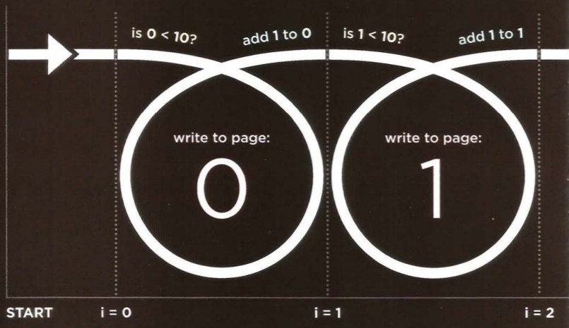
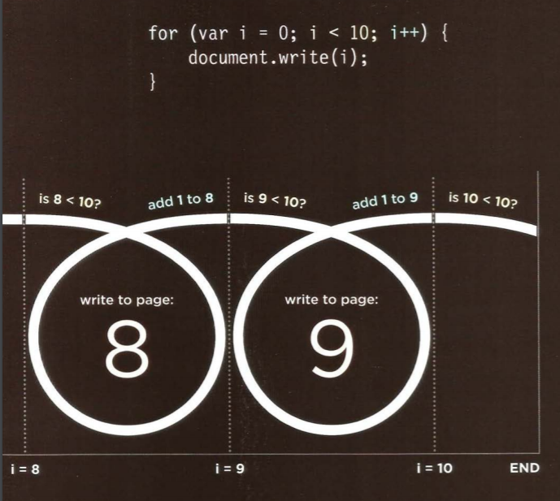
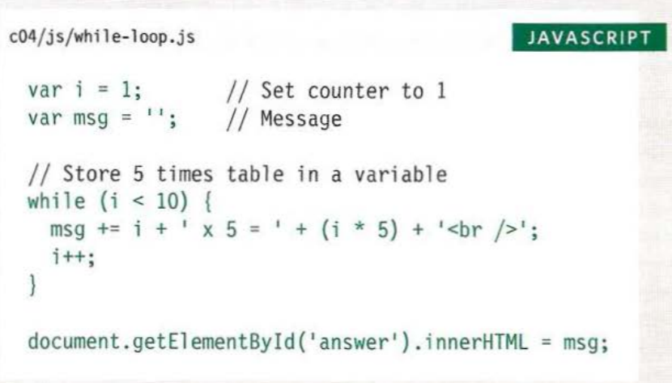
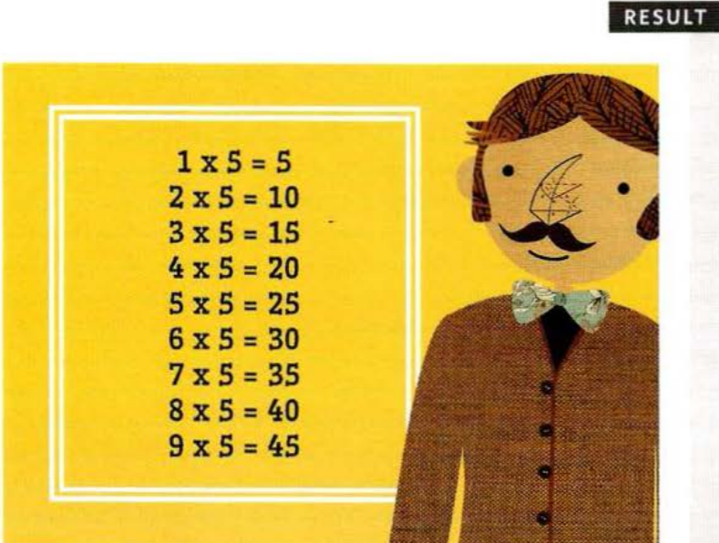

# Decisions and Loops
###### Chapter 4

---
---
### Comparison Operators: Evaluating Conditions

You can evaluate a situation by comparing one value in the script to what you expect it might be. The result will be a boolean: true or false.

- Is equal to = =
This operator compares two values (numbers, strings, or Booleans) to see if they are the same.

- Is not equal to ! =
This operator compares two values (numbers, strings, or Booleans) to see if they are not the same.

- Strict Equal To = = =
This operator compares two values to check that both the data type and value are the same.

- Strict Not Equal To ! = =
This operator compares two values to check thata both the data type and value are not the same.

### Logical Operators

Comparison operators usually return single values of ** true ** or ** false **. Logical operators allow you to compare the results of more than one comparison operator.

- Logical ** and ** &&
This operator tests more than one condition.

- Logical ** or ** ||
This operator tests at least one condition.

-Logical ** not ** !
This operator takes a single Boolean value and inverts it.

-----
-----

### Loops
Loops check a condition. If it returns ** true **, a code block will run. Then the condition will be checked again and if it still returns ** true **, the code block will run again. It repeats until the condition returns ** false **. 
There are three common types of loops:
- for 
- while
- do while

### Loop counters
A ** for ** loop uses a counter as a condition.
This instructs the code to run a specified number of times. 
Here you can see the condition is made up of three statements:

- Initialization
- Condition
- Update

#### Looping

 
The first time the loop is run, the variable ** i ** (the counter) is assigned a value of zero. 
Everytime the loop is run, the condition is checked. Is the variable ** i ** less than 10?
Then the code inside the loop (the statements between the curly brackets) is run.

The variable ** i ** can be used inside the loop. Here it is used to write a number to the page.
When the statements have finished, the variable ** i ** is incremented by 1.
When the condition is no longer true, the loop ends. The script moves to the next line of code.

#### Using While Loops
A While loop is typically used when tou do not know how many times you want the code to run. It should continue to run as long as a condition is met.

Example: It writes out the 5 times table. Each time the loop is run, another calculation is written into the variable called message.

as long as the condition in the parenthesis is true, the loop will continue to run. That condition is a counter indicating that, as long as the variable ** i ** reamins less than 10, the statements in the subsequent code block should run.

Inside the code block there are two statements:
- The first statement uses the += operator, which is used to add new content to the message variable. Each time the loop runs, a new calculation and line break is added to the end of the message being stored in it. So += works as a shorthand for writing: msg = msg + 'new msg' .
- The second statement increments the counter variable by one. (This is done inside the loop rather than with the condition.)
When the loop has finished, the interpreter goes to the next line of code, which writes the msg variable to the page. 

---

To check out more of this book [CLICK HERE!](https://www.amazon.com/JavaScript-JQuery-Interactive-Front-End-Development/dp/1118531647)

