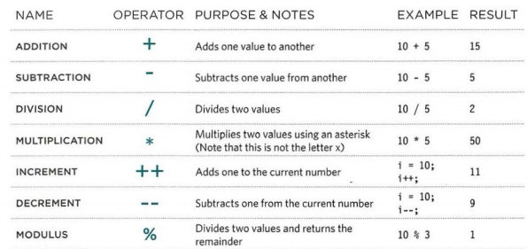

# Introduction
by JON DUCKETT

---
---

## How javascript makes webpages more interactive

1- ACCESS CONTENT
2- MODIFY CONTENT 
3- PROGRAM RULES
4- REACT TO EVENTS

##### Examples of javasript in the browser
Being able to change the content of an HTML page while it is loaded in the browser is very powerful. 
The examples below rely on the ability to:
- Access the content of the page
- Modify the content of the page
- Program rules or instructions the browser can follow
- React to events triggered by the user or browse

---

# EXPRESSIONS

An expression evaluates into (results in) a single value. 

###### There are two types of expressions. 

1- Expressions that just assign a value to a variable.
2- Expressions that just use two or more values to return a single value. 

---

# OPERATORS 

Expressions rely on operators, they allow programmers to
create a single value from one or more values. For example:

- Assignment operators (assign a value to a variable)
- Arithmetic operators (perform basic math)
- String operators (combine two strings)

---

##### Arithmetic operators
JavaScript contains the following mathematical
operators, which you can use with numbers.

##### String operators
There is just one string operator: the+ symbol.
It is used to join the strings on either side of it. 

---

#### Chapter 3
##### Functions, methods, and objects

##### What is a function?
Functions let you group a series of statements together to perform a specific task. If different parts of a script repeat the same task, you can reuse the function (rather than repeating the same set of statements).

##### Declaring a function
To create a function, you give it a name and then write the statements needed to achieve its tasks inside the curly braces.

##### Calling a function
Having declared the function, you can the excute all of the statements between its curly braces with just one line of code.

##### Declaring functions that need information
Sometimes a function need specific informstion to perform its task. In such cases, when you declare the function you give it parameters, and inside the parameters the functions act like variables.

##### Calling functions that need information
When you call a function that has parameters, you specify the values it should use in the parantheses that follow its name. The value are called arguments, and they can be provided as values or as variables.

##### Getting a single value out of a function
Some funtions return information to the code that called them. For example, when they perform a calculation, they return the result.

